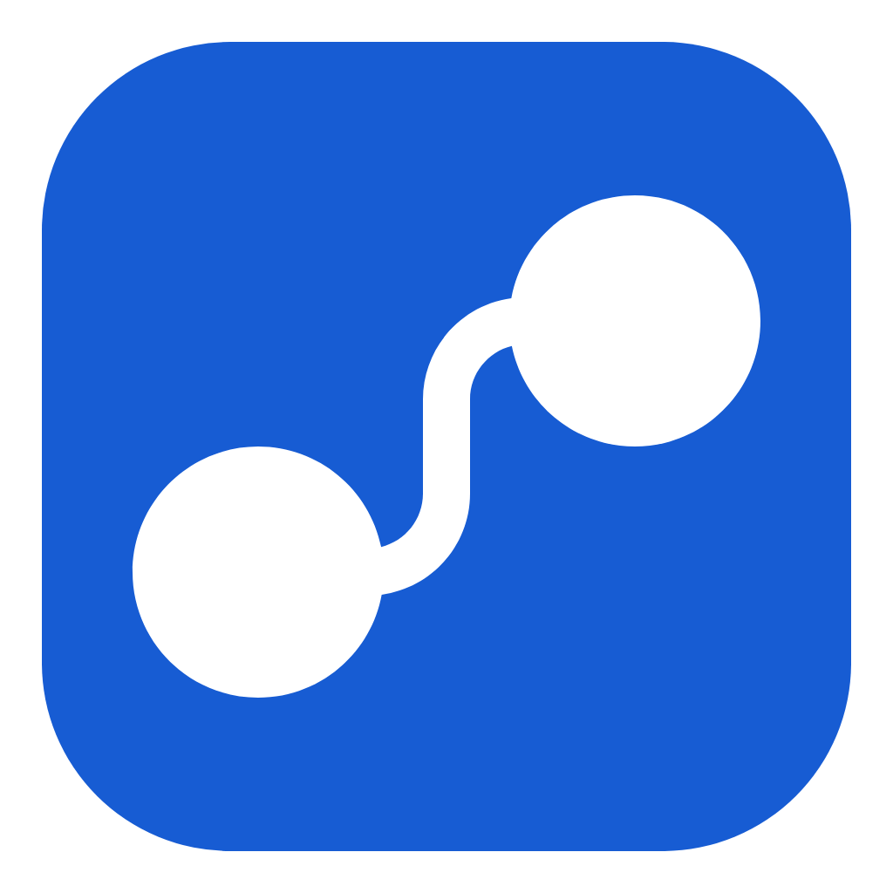

<div align="center">
  
  <h1>知序 Zhixu</h1>
  <p>面向 Windows 的本地优先个人任务与学习规划工作台</p>

[](https://github.com/galaxywk223/zhixu/actions/workflows/release.yml)
[](https://github.com/galaxywk223/zhixu/releases/latest)
[](LICENSE)
</div>

知序用于统一管理任务、日历、专注记录、睡眠、倒计时、备忘和个人消费分析。Windows 客户端以本地 SQLite 作为工作数据源，并通过账户提供跨设备同步；首次账户绑定完成后，网络不可用时仍可继续使用本地工作区。

## 核心能力

- 任务管理：分类、标签、优先级、截止时间、状态流转和多种工作区视图。
- 日历规划：周视图、日程区块及任务时间安排。
- 专注记录：计时、番茄 TODO 历史导入、趋势统计与复盘。
- 生活记录：睡眠时间、生活事件、备忘和重要日期倒计时。
- 消费分析：支付宝 CSV 与微信 XLSX 账单导入、稳定去重、人工调整、分类统计和净消费趋势。
- 每日格言：离线精选语料与 AI 生成内容混合，收藏和不喜欢反馈用于后续内容选择。
- 数据保障：本地备份、旧版 Flutter 数据迁移、账户同步和版本更新。

## 安装使用

Windows 10/11 x64 安装包位于 [GitHub Releases](https://github.com/galaxywk223/zhixu/releases/latest)。安装包尚未接入商业代码签名，Windows SmartScreen 可能显示未知发布者。

当前 Windows 稳定版需要已配置的知序账户服务。首次注册需完成邮箱验证，首次登录会在独立备份后合并本地与云端数据；首次同步完成后可离线进入工作区。应用内更新从本仓库的稳定版 Release 获取。

Android 客户端属于后续规划，当前仓库不包含 Android 业务实现，也不提供 Android 安装包。

## 数据与同步

| 数据位置                                      | 内容                                  |
| --------------------------------------------- | ------------------------------------- |
| `%LOCALAPPDATA%\Zhixu\Data\zhixu.sqlite`      | Electron 客户端主数据库               |
| `%LOCALAPPDATA%\Zhixu\MigrationBackups`       | 旧版数据库迁移备份                    |
| `%LOCALAPPDATA%\Zhixu\SyncBackups`            | 首次同步前备份                        |
| `%APPDATA%\GalaxyWK\Zhixu\Zhixu\zhixu.sqlite` | 旧 Flutter 客户端数据库，仅迁移时读取 |

任务、分类、标签、日程、专注记录、生活事件、倒计时、财务记录和每日格言可通过 Supabase 同步。原始账单文件只在本地解析，不会作为文件上传；导入后生成的结构化财务记录会参与同步。完整数据处理边界见 [隐私说明](PRIVACY.md)。

## 隐私边界

- 应用不包含遥测、广告 SDK 或行为分析服务。
- 账户认证和业务同步由 Supabase 提供。
- AI 每日格言由 Supabase Edge Function 调用 DeepSeek；请求仅包含日期及有限数量的格言偏好文本。
- GitHub Release 用于版本检查、安装包下载和更新。
- 登录会话使用 Electron `safeStorage` 加密保存在当前 Windows 用户目录。

详细说明及数据清理方式见 [PRIVACY.md](PRIVACY.md)。

## 技术架构

```text
apps/windows/            Electron + React Windows 客户端
shared/contracts/        跨端 TypeScript 类型与 JSON Schema
shared/fixtures/         跨语言业务验收夹具
native/tomatodo_importer Rust 番茄 TODO 解析核心与 CLI
supabase/                数据库迁移、同步协议与 Edge Function
```

- Electron 主进程负责 SQLite、备份、导入、同步、更新和窗口生命周期。
- Context Bridge 暴露受限桌面 API，IPC 输入通过类型与模式约束。
- React 19、Fluent UI、TanStack Query 和 Recharts 构成渲染层。
- better-sqlite3 提供本地持久化，Supabase Auth、Postgres 和 Realtime 提供账户与同步能力。
- electron-vite 负责三层构建，electron-builder 生成 NSIS x64 安装包。

## 开发验证

环境要求：Windows 10/11 x64、Node.js 24、pnpm 10、Rust stable。

```powershell
pnpm install
pnpm lint
pnpm typecheck
pnpm test
cargo fmt --manifest-path native/tomatodo_importer/Cargo.toml -- --check
cargo test --manifest-path native/tomatodo_importer/Cargo.toml
pnpm build:windows
pnpm package:windows
pnpm self-test:windows
```

`pnpm dev:windows` 启动开发客户端。构建所需的公开 Supabase 配置见 [.env.example](.env.example)；部署凭据不得写入仓库或打包进客户端。

贡献流程和 Pull Request 要求见 [CONTRIBUTING.md](CONTRIBUTING.md)。

## 项目状态

- 当前正式支持平台为 Windows 10/11 x64。
- 最新稳定版本以 [GitHub Latest Release](https://github.com/galaxywk223/zhixu/releases/latest) 为准。
- 发布工作流验证 TypeScript、React、Rust、安装包、自检、静默安装和卸载流程。
- 安装包暂未进行代码签名。
- Android、macOS 和 Linux 客户端不在当前支持范围内。

## 开源信息

项目使用 [MIT License](LICENSE)。第三方软件及素材许可见 [THIRD_PARTY_NOTICES.md](THIRD_PARTY_NOTICES.md)，安全报告流程见 [SECURITY.md](SECURITY.md)。
